# Road Trip Itineraries: Milan → Mondsee → Return
## June 24-30, 2026 | Two Route Options

---

## 📍 TRIP OVERVIEW

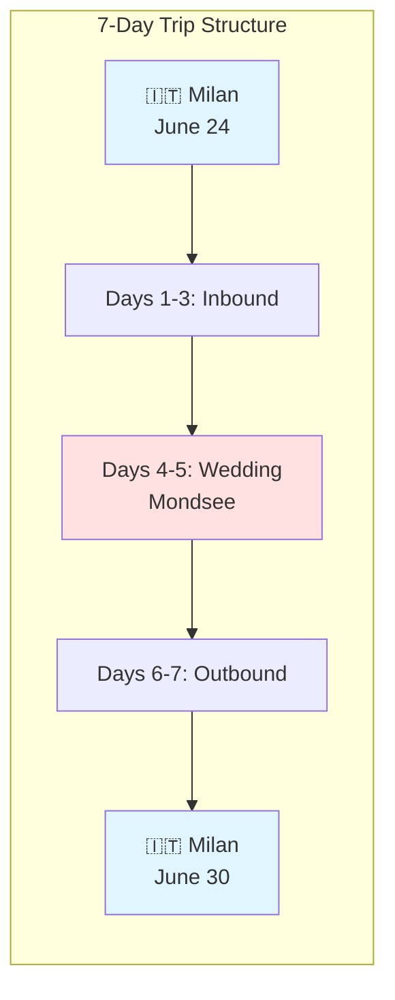

---

## 🗺️ INBOUND ROUTE (Same for Both Options)
### Milan → Mondsee (June 24-26)

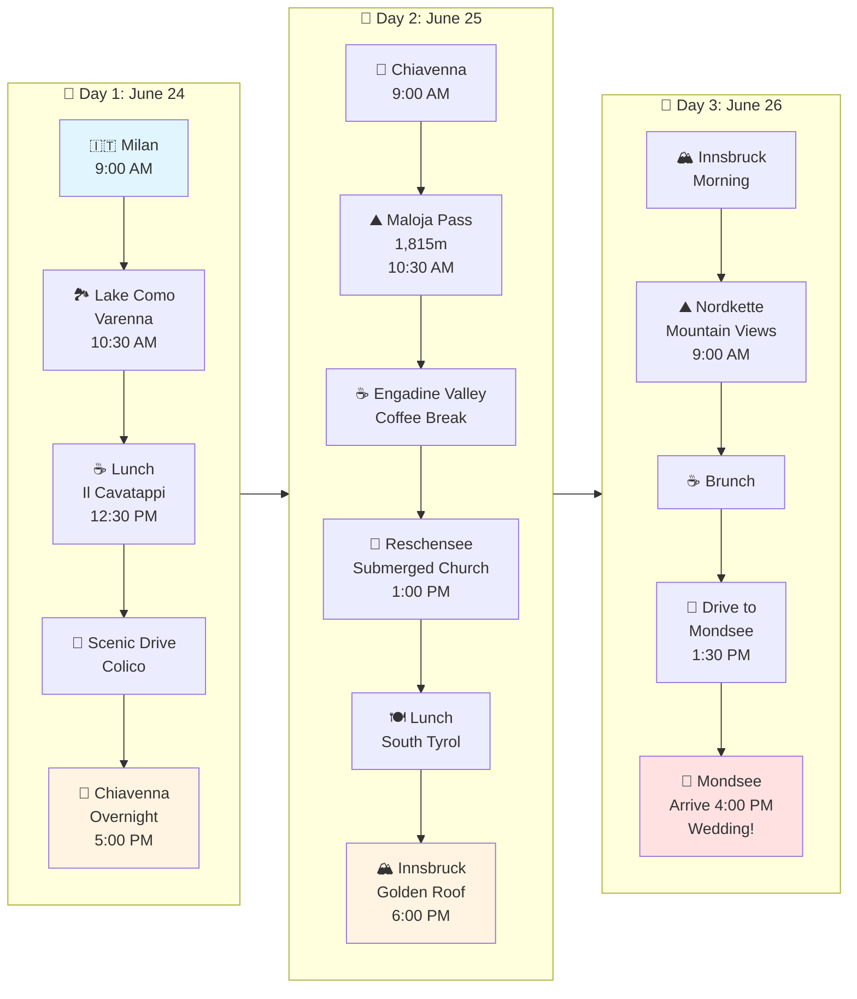

---

## 🅰️ OPTION A: South Tyrol & Verona
### Outbound: Mondsee → Bolzano → Verona → Milan

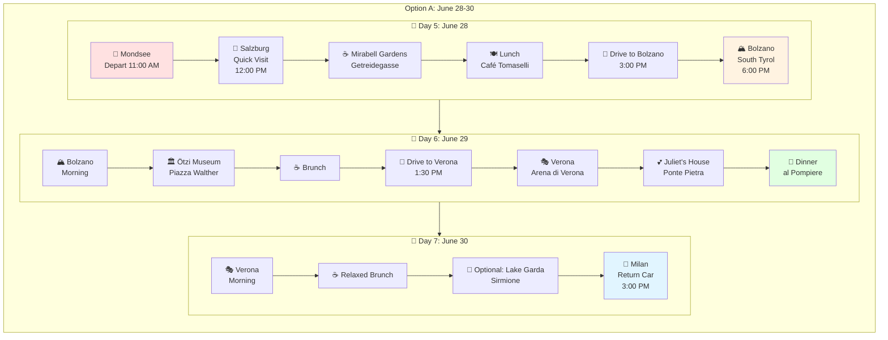

---

## 🅱️ OPTION B: Dolomites & Venice
### Outbound: Mondsee → Cortina → Venice → Milan

```mermaid
flowchart TB
    subgraph OptionB_Outbound["Option B: June 28-30"]
        direction TB

        subgraph Day5B["📅 Day 5: June 28"]
            D1["💒 Mondsee
            Depart 11:00 AM"] --> D2["🚗 Scenic Drive
            Via Salzburg"] --> D3["⛰️ Felbertauern Tunnel"] --> D4["☕ Lienz
            Coffee"] --> D5["🏔️ Enter Dolomites
            San Candido"] --> D6["✨ Cortina d'Ampezzo
        Pearl of Dolomites
        6:30 PM"]
        end

        subgraph Day6B["📅 Day 6: June 29"]
            E1["🏔️ Cortina
            Morning"] --> E2["🏞️ Lake Misurina
            9:30 AM"] --> E3["⛰️ Tre Cime di Lavaredo
            11:00 AM"] --> E4["🛣️ Great Dolomite Road
            12:00 PM"] --> E5["🍽️ Mountain Lunch
            Passo Falzarego"] --> E6["🚗 Drive to Venice
            2:00 PM"] --> E7["🎭 Venice
            St. Mark's Square
            5:00 PM"] --
            E8["🍷 Dinner
            Cicchetti & Wine"]
        end

        subgraph Day7B["📅 Day 7: June 30"]
            F1["🎭 Venice
            Morning"] --> F2["🛥️ Grand Canal
            Vaporetto"] --> F3["🌉 Rialto Bridge
            Final Walks"] --> F4["☕ Brunch"] --> F5["🏁 Milan
            Return Car
            3:00 PM"]
        end

        Day5B --> Day6B --> Day7B
    end

    style D1 fill:#ffe1e1
    style D6 fill:#fff3e1
    style E8 fill:#e1ffe1
    style F5 fill:#e1f5ff
```

---

## 🗺️ GEOGRAPHIC ROUTE MAP

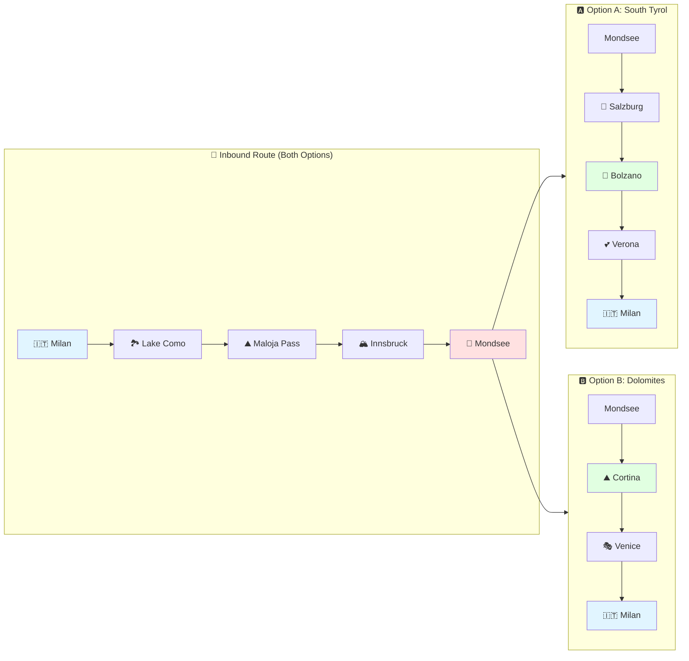

---

## 📊 OPTION COMPARISON

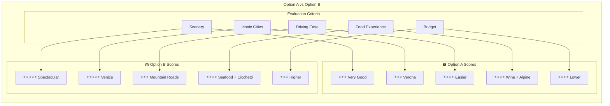

---

## 🍽️ RESTAURANT HIGHLIGHTS

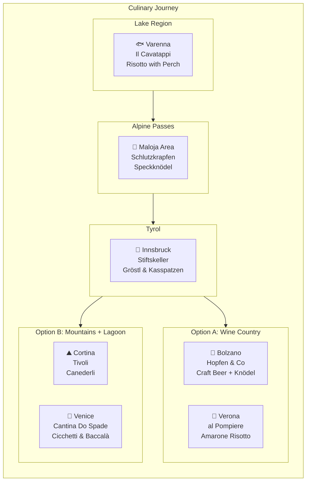

---

## ⏱️ DRIVING TIME COMPARISON

```mermaid
flowchart LR
    subgraph DrivingTimes["Total Driving Hours"]
        direction TB

        subgraph Inbound["Inbound (Both)"]
            I1["Day 1: 2.5 hrs"]
            I2["Day 2: 4.5 hrs"]
            I3["Day 3: 2.5 hrs"]
            I_Total["Total: ~9.5 hrs"]
        end

        subgraph OptionA_Drive["Option A Driving"]
            A1["Day 5: 4 hrs"]
            A2["Day 6: 2 hrs"]
            A3["Day 7: 2 hrs"]
            A_Total["Total: ~8 hrs"]
        end

        subgraph OptionB_Drive["Option B Driving"]
            B1["Day 5: 4.5 hrs"]
            B2["Day 6: 2 hrs"]
            B3["Day 7: 3 hrs"]
            B_Total["Total: ~9.5 hrs"]
        end

        I1 --> I2 --> I3 --> I_Total
        A1 --> A2 --> A3 --> A_Total
        B1 --> B2 --> B3 --> B_Total
    end

    style I_Total fill:#e1f5ff
    style A_Total fill:#e1ffe1
    style B_Total fill:#ffe1a1
```

---

## 🎯 DECISION FLOWCHART

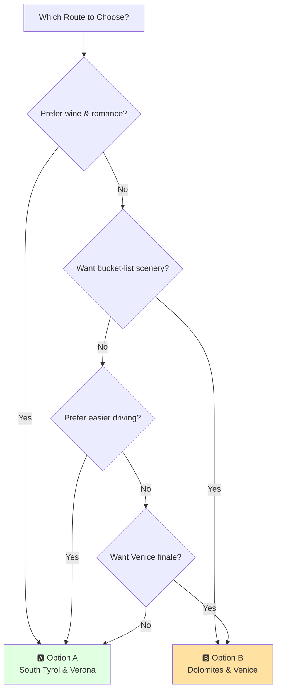

---

## 🏔️ ELEVATION PROFILE

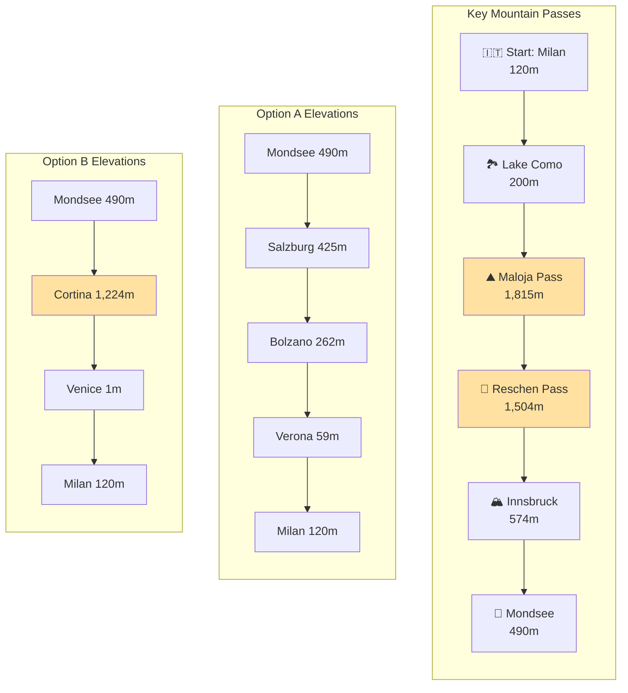

---

## 🎭 ACTIVITY HIGHLIGHTS

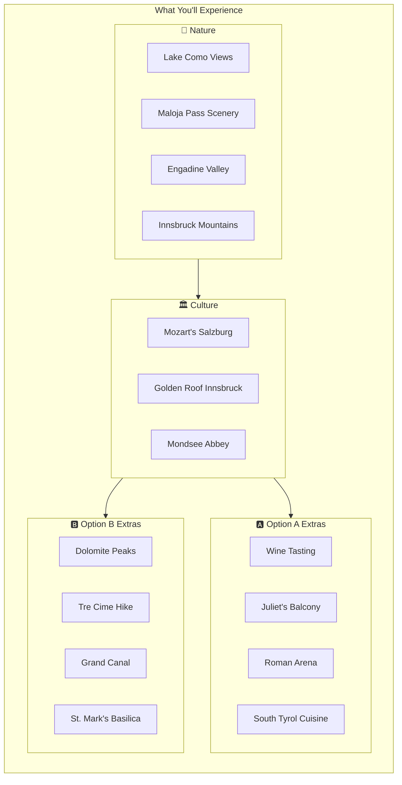

---

## 📅 COMPLETE TIMELINE

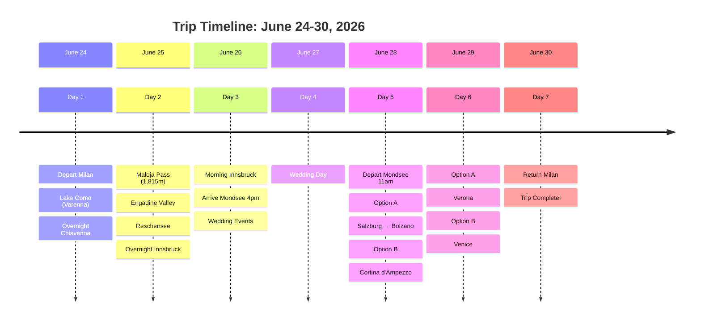

---

## 🚗 TRANSPORT MODE TRANSITIONS

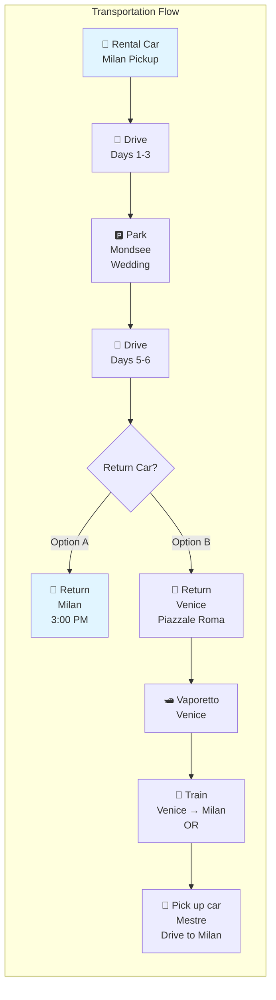

---

## 💰 BUDGET COMPARISON

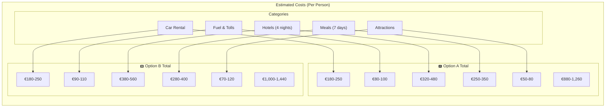

---

## 📍 FINAL SUMMARY

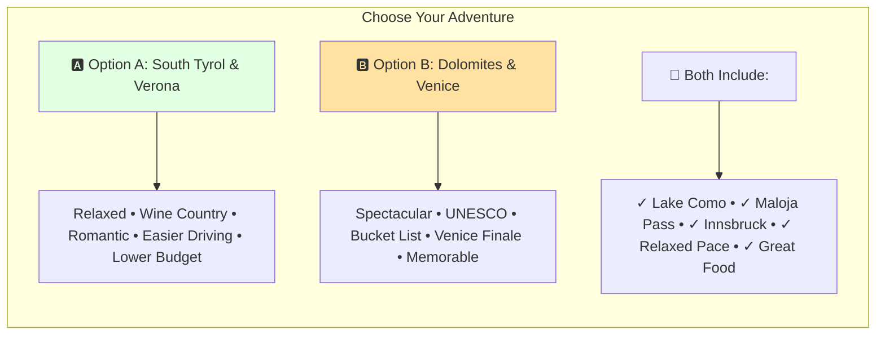

---

*Generated: February 28, 2026*  
*Trip Dates: June 24-30, 2026*  
*Group: 2 couples (4 people)*  
*Repository: https://github.com/sagar-clawbot/milan-mondsee-road-trip*
