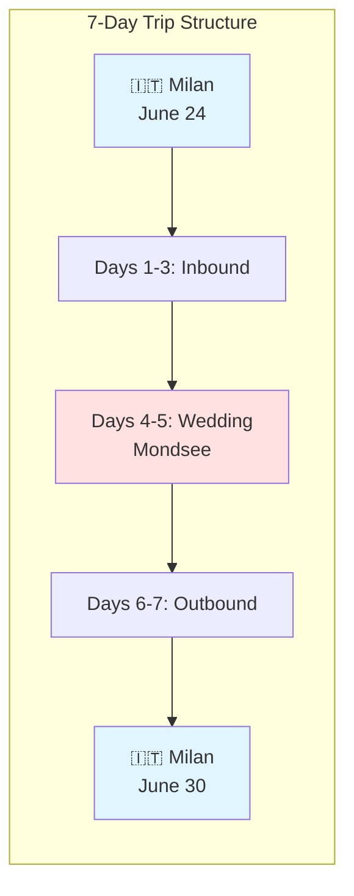
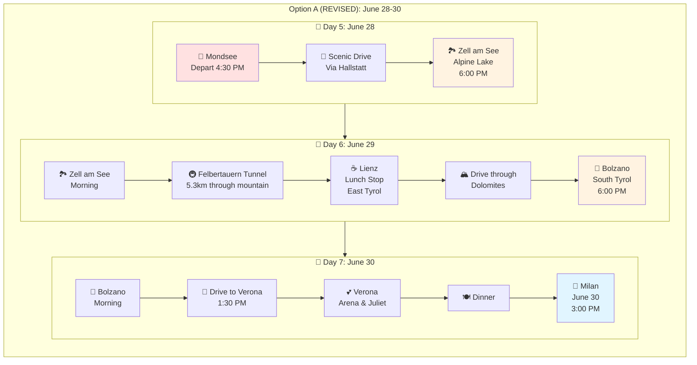
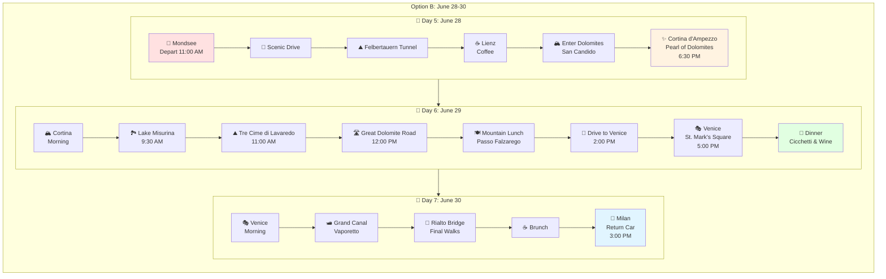
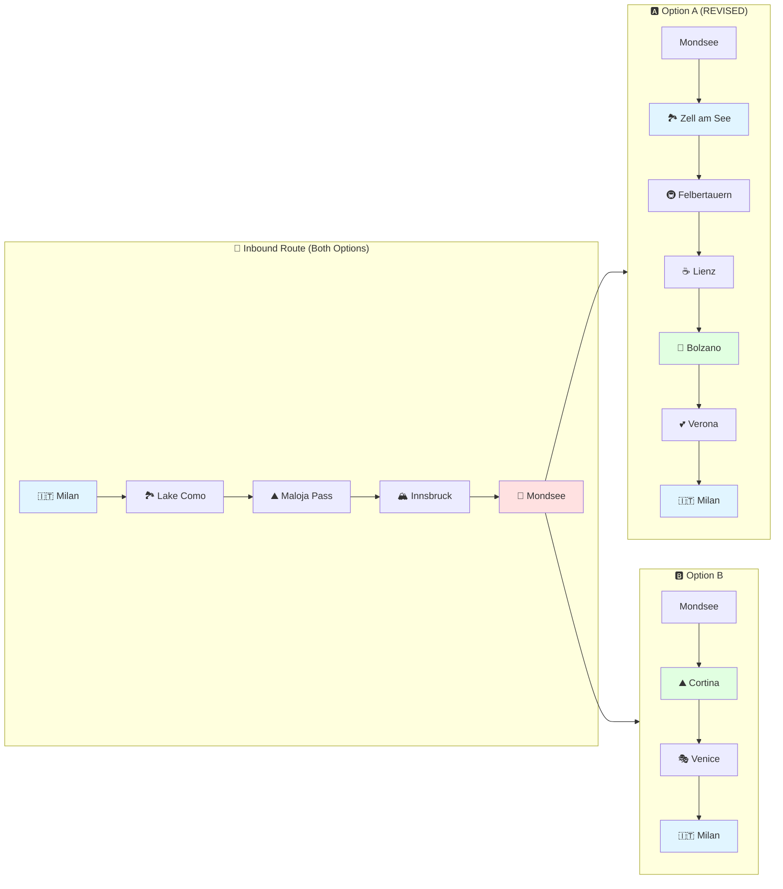
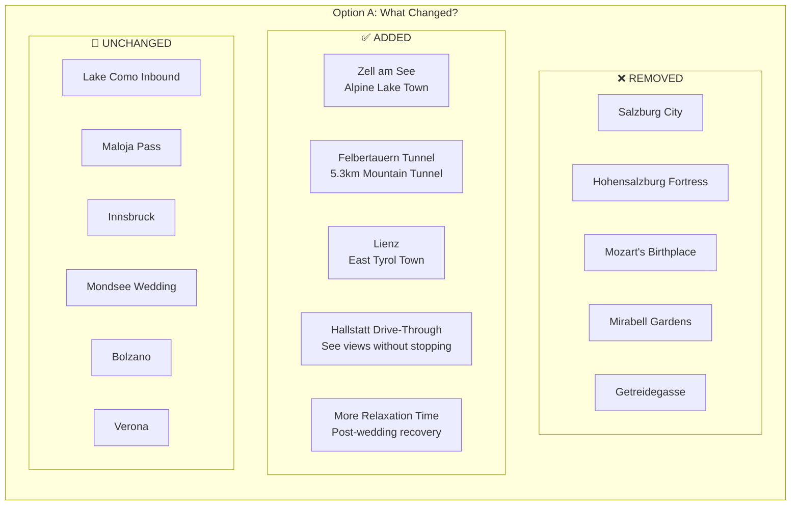
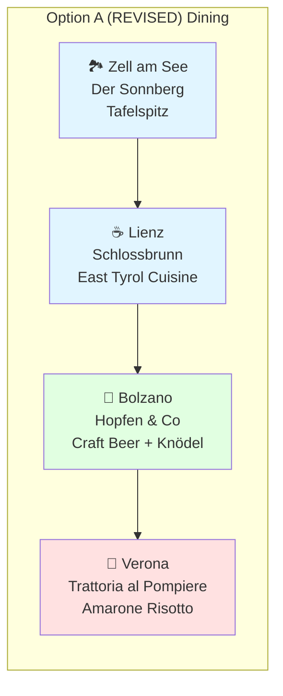
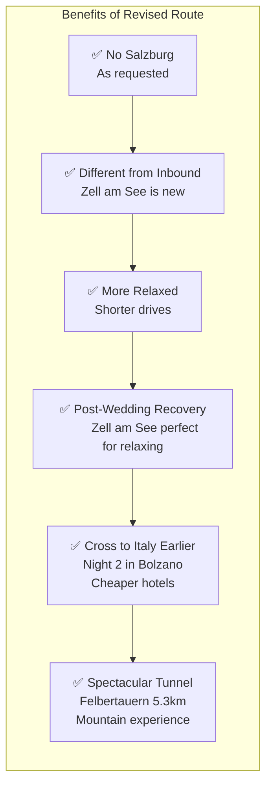

# Road Trip Itineraries: Milan → Mondsee → Return
## June 24-30, 2026 | Two Route Options

**⚠️ UPDATE:** Option A has been revised - Salzburg removed, Zell am See added

---

## 📍 TRIP OVERVIEW

---

## 🅰️ OPTION A (REVISED): Zell am See, South Tyrol & Verona
### Outbound: Mondsee → Zell am See → Bolzano → Verona → Milan
**🆕 NO SALZBURG - New route via Felbertauern Tunnel**

**Key Changes:**
- ❌ **Removed:** Salzburg entirely
- ✅ **Added:** Zell am See (alpine lake), Felbertauern Tunnel, Lienz
- 🎯 **Benefit:** More relaxed, completely different scenery from inbound

---

## 🅱️ OPTION B: Dolomites & Venice
### Outbound: Mondsee → Cortina → Venice → Milan

---

## 🗺️ GEOGRAPHIC ROUTE MAP

---

## 📊 COMPARISON: CHANGES IN OPTION A

---

## 🍽️ RESTAURANTS: OPTION A (REVISED)

---

## 🎯 WHY THE CHANGE?

---

## 📄 AVAILABLE FILES

### Option A (REVISED)
- **ITINERARY_OPTION_A_REVISED_NO_SALZBURG.md** - Detailed day-by-day
- **ITINERARY_OPTION_A_REVISED_NO_SALZBURG.pdf** - Printable version

### Option B
- **ITINERARY_OPTION_B_COMPLETE.md** - Detailed day-by-day  
- **ITINERARY_OPTION_B_COMPLETE.pdf** - Printable version

---

*Last updated: February 28, 2026*  
*Option A revised to remove Salzburg, add Zell am See*  
*All diagrams render on GitHub*
