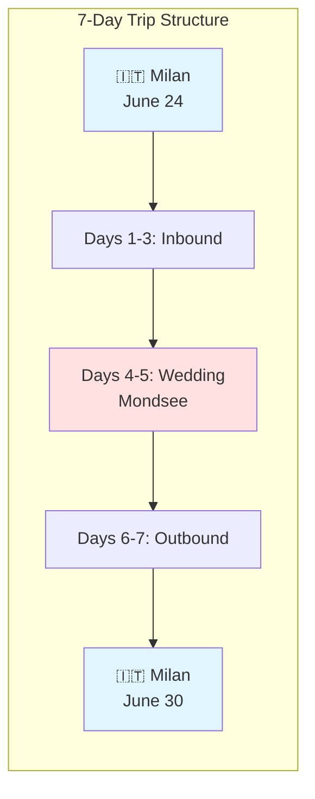
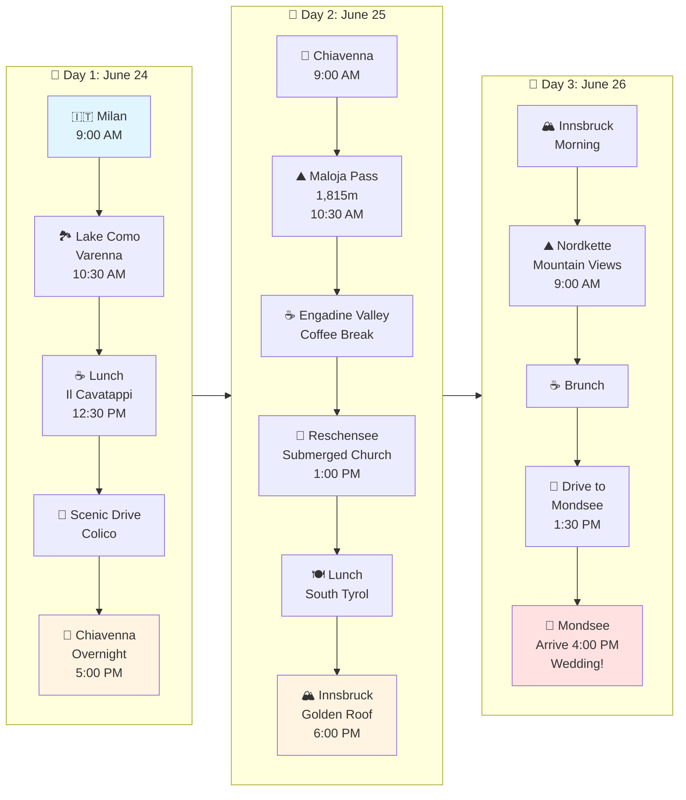
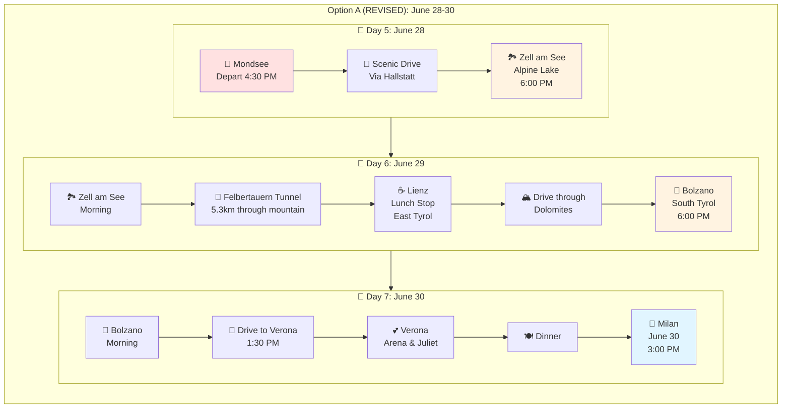
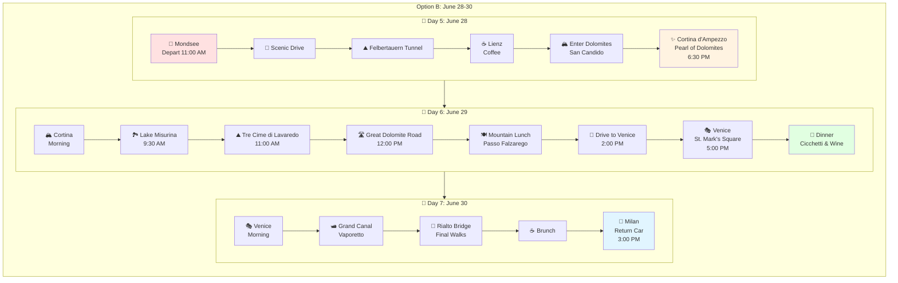
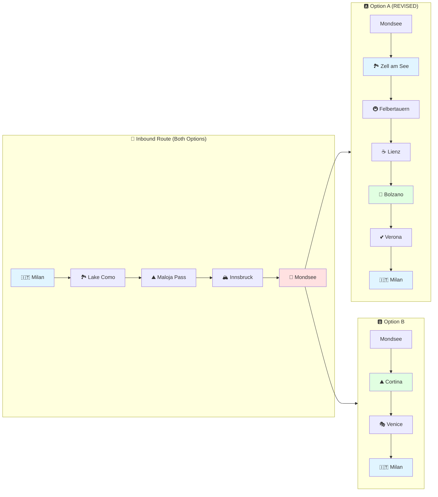
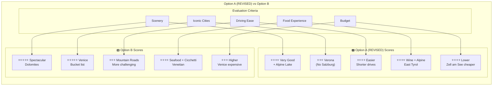
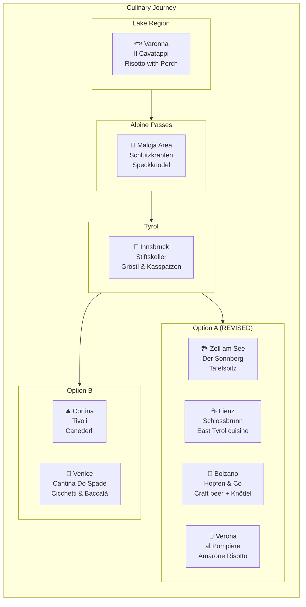
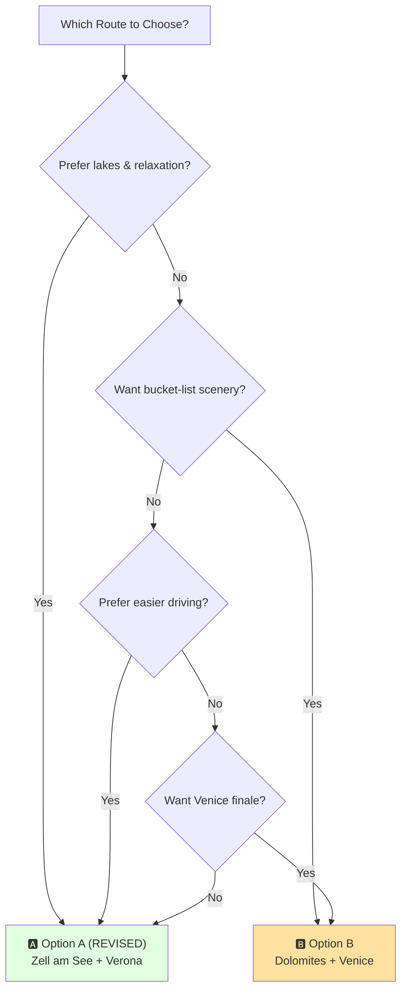
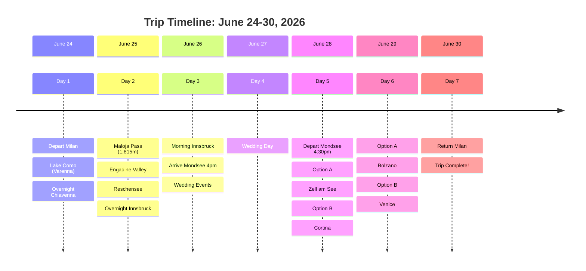

# Road Trip Itineraries: Milan → Mondsee → Return
## June 24-30, 2026 | Two Route Options

---

## 🚨 RECENT UPDATE (Feb 28, 2026)

**Option A has been REVISED:**
- ❌ **Removed:** Salzburg entirely
- ✅ **Added:** Zell am See, Felbertauern Tunnel, Lienz
- 🗺️ **New Route:** Mondsee → Zell am See → Bolzano → Verona

---

## 📍 TRIP OVERVIEW

---

## 🗺️ INBOUND ROUTE (Same for Both Options)
### Milan → Mondsee (June 24-26)

---

## 🅰️ OPTION A (REVISED): Zell am See, South Tyrol & Verona
### Outbound: Mondsee → Zell am See → Bolzano → Verona → Milan
**🆕 UPDATED: No Salzburg!**

**Changes from Original:**
- ❌ **Removed:** Salzburg, Mirabell Gardens, Mozart sites
- ✅ **Added:** Zell am See (alpine lake), Felbertauern Tunnel, Lienz (East Tyrol)

---

## 🅱️ OPTION B: Dolomites & Venice
### Outbound: Mondsee → Cortina → Venice → Milan

---

## 🗺️ GEOGRAPHIC ROUTE MAP

---

## 📊 OPTION COMPARISON

---

## 🍽️ RESTAURANT HIGHLIGHTS

---

## ⏱️ DRIVING TIME COMPARISON

```mermaid
flowchart LR
    subgraph DrivingTimes["Total Driving Hours"]
        direction TB

        subgraph Inbound["Inbound (Both)"]
            I1["Day 1: 2.5 hrs"]
            I2["Day 2: 4.5 hrs"]
            I3["Day 3: 2.5 hrs"]
            I_Total["Total: ~9.5 hrs"]
        end

        subgraph OptionA_Drive["Option A (REVISED) Driving"]
            A1["Day 5: 1.5 hrs"]
            A2["Day 6: 3.5 hrs"]
            A3["Day 7: 2 hrs"]
            A_Total["Total: ~7 hrs"]
        end

        subgraph OptionB_Drive["Option B Driving"]
            B1["Day 5: 4.5 hrs"]
            B2["Day 6: 2 hrs"]
            B3["Day 7: 3 hrs"]
            B_Total["Total: ~9.5 hrs"]
        end

        I1 --> I2 --> I3 --> I_Total
        A1 --> A2 --> A3 --> A_Total
        B1 --> B2 --> B3 --> B_Total
    end

    style I_Total fill:#e1f5ff
    style A_Total fill:#e1ffe1
    style B_Total fill:#ffe1a1
```

---

## 🎯 DECISION FLOWCHART

---

## 📅 COMPLETE TIMELINE

---

## 📄 AVAILABLE FILES

### Option A (REVISED - No Salzburg)
- **[Markdown](ITINERARY_OPTION_A_REVISED_NO_SALZBURG.md)** - Detailed day-by-day
- **[PDF](ITINERARY_OPTION_A_REVISED_NO_SALZBURG.pdf)** - Printable version

### Option B (Unchanged)
- **[Markdown](ITINERARY_OPTION_B_COMPLETE.md)** - Detailed day-by-day
- **[PDF](ITINERARY_OPTION_B_COMPLETE.pdf)** - Printable version

---

## 🔄 WHAT CHANGED IN OPTION A?

### ❌ REMOVED:
- Salzburg (city, fortress, Mozart sites)
- Mirabell Gardens
- Getreidegasse

### ✅ ADDED:
- **Zell am See** - Alpine lake town (Night 1)
- **Felbertauern Tunnel** - 5.3km mountain tunnel
- **Lienz** - East Tyrol charming town (lunch)
- Hallstatt drive-through (optional)

### 🔄 SAME:
- Lake Como inbound
- Maloja Pass
- Innsbruck
- Mondsee wedding
- Bolzano
- Verona

---

*Repository last updated: February 28, 2026*  
*Option A revised to remove Salzburg*  
*All Mermaid diagrams render interactively on GitHub*
