# Road Trip Itinerary: Austria → Italy → Paris

Beautiful Mermaid diagrams visualizing a 4-day road trip from Mondsee (Austria) through the Alps to Venice and Paris.

## 📍 Trip Overview

- **Start:** Mondsee, Austria
- **Route:** Wolfgangsee → Grossglockner Pass → Dolomites → Venice
- **End:** Paris, France
- **Duration:** 4 days (June 28 - July 1, 2026)
- **Group:** 2 couples (4 people)

## 📊 Interactive Diagrams

This repository contains Mermaid diagrams that render beautifully on GitHub:

1. **[Complete Trip Flowchart](road_trip_mermaid.md)** - Day-by-day visual itinerary
2. **[Route Summary](road_trip_mermaid.md#route-map-summary)** - Simplified route map
3. **[Timeline View](road_trip_mermaid.md#key-highlights-timeline)** - Chronological highlights
4. **[Transport & Logistics](road_trip_mermaid.md#transport--logistics)** - Modes of transport

## 📄 Full Itineraries

- **[Option 1: Classic Alpine Route](final_itinerary_option1_classic_alpine.md)** - Via Grossglockner, Dolomites, Venice
- **[Option 2: Eastern Slovenia Route](final_itinerary_option2_eastern_slovenia.md)** - Via Lake Bled, Vršič Pass, Ljubljana

## 🗺️ Preview

```mermaid
flowchart TB
    subgraph Day1["📅 Day 1: Austria"]
        A1["Mondsee"] --> A2["Wolfgangsee"]
        A2 --> A3["Grossglockner Pass"]
        A3 --> A4["Heiligenblut"]
    end
    
    subgraph Day2["📅 Day 2: Border Crossing"]
        B1["Heiligenblut"] --> B2["Dolomites"]
        B2 --> B3["Cortina"]
    end
    
    subgraph Day4["📅 Day 4: Venice & Paris"]
        C1["Cortina"] --> C2["Venice"]
        C2 --> C3["Paris"]
    end
    
    Day1 --> Day2 --> Day4
```

## 🚀 View Full Diagrams

Click on [road_trip_mermaid.md](road_trip_mermaid.md) to see all interactive diagrams!

---

*Generated by Scooby 🐕 - AI Travel Assistant*
