# Road Trip Itinerary: Austria → Italy → Paris

## Trip Overview

```mermaid
flowchart TB
    subgraph Day1["📅 Day 1: Sunday June 28"]
        A1["🇦🇹 Mondsee
        8:00 AM Departure"] --> A2["🇦🇹 Wolfgangsee
        Mozart's Sister Nannerl
        8:30-10:30 AM"]
        A2 --> A3["☕ Bad Ischl
        Coffee & Culture
        11:00 AM-12:30 PM"]
        A3 --> A4["⛰️ Grossglockner Pass
        2,504m Elevation
        2:00-6:00 PM"]
        A4 --> A5["🏨 Heiligenblut
        Overnight"]
    end

    subgraph Day2["📅 Day 2: Monday June 29"]
        B1["🏨 Heiligenblut"] --> B2["⛰️ Iselsberg Pass
        1,104m
        9:45 AM"]
        B2 --> B3["☕ Lienz
        Coffee Stop
        11:00 AM"]
        B3 --> B4["🇮🇹 Border Crossing
        Sillian → San Candido
        2:30 PM"]
        B4 --> B5["🏔️ Dolomites
        Cortina d'Ampezzo
        5:00 PM"]
        B5 --> B6["🏨 Cortina
        2 Nights"]
    end

    subgraph Day3["📅 Day 3: Tuesday June 30"]
        C1["🏨 Cortina"] --> C2["🏞️ Lake Misurina
        9:30 AM"]
        C2 --> C3["⛰️ Tre Cime di Lavaredo
        Optional Hike
        10:30 AM"]
        C3 --> C4["🛣️ Great Dolomite Road
        SS48 Scenic Drive
        12:00 PM"]
        C4 --> C5["⛰️ Passo Falzarego
        2,105m
        2:00 PM"]
        C5 --> C6["🏨 Cortina
        Evening"]
    end

    subgraph Day4["📅 Day 4: Wednesday July 1"]
        D1["🏨 Cortina"] --> D2["🚗 Drive to Venice
        2 hours / 160 km
        8:00 AM"]
        D2 --> D3["🇮🇹 Venice
        Arrive 10:00 AM"]
        D3 --> D4["🏛️ St. Mark's Square
        Basilica & Doge's Palace
        10:30 AM-1:00 PM"]
        D4 --> D5["🌉 Rialto Bridge
        & Market
        2:00 PM"]
        D5 --> D6["🛥️ Canal Exploration
        4:00 PM"]
        D6 --> D7["🚂 Train to Paris
        6:25 PM"]
        D7 --> D8["🇫🇷 Paris
        Arrive 11:22 PM"]
    end

    Day1 --> Day2 --> Day3 --> Day4

    style A1 fill:#e1f5ff
    style A5 fill:#fff3e1
    style B6 fill:#fff3e1
    style C6 fill:#fff3e1
    style D3 fill:#ffe1e1
    style D8 fill:#e1ffe1
```

---

## Daily Details

### Day 1: Mondsee → Heiligenblut (Austria)
**Theme:** Austrian Lakes & Alpine Pass Crossing  
**Distance:** ~180 km | **Driving:** 5-6 hours with stops

| Time | Location | Activity | Notes |
|------|----------|----------|-------|
| 8:00 AM | Mondsee | Depart | Pick up rental cars |
| 8:30 AM | Wolfgangsee | Visit | Mozart's sister Nannerl lived here |
| 11:00 AM | Bad Ischl | Coffee | Café Zauner (est. 1832) |
| 2:00 PM | Grossglockner | Drive | €40 toll, 36 hairpin turns |
| 6:00 PM | Heiligenblut | Arrive | Overnight in alpine village |

---

### Day 2: Heiligenblut → Cortina (Austria → Italy)
**Theme:** Mountain Passes & Border Crossing  
**Distance:** ~150 km | **Driving:** 4-5 hours

| Time | Location | Activity | Notes |
|------|----------|----------|-------|
| 9:00 AM | Heiligenblut | Depart | |
| 9:45 AM | Iselsberg Pass | Scenic drive | 1,104m elevation |
| 11:00 AM | Lienz | Coffee stop | East Tyrol |
| 2:30 PM | Border | Cross to Italy | Sillian → San Candido |
| 5:00 PM | Cortina | Arrive | "Pearl of the Dolomites" |

---

### Day 3: Dolomites Exploration (Italy)
**Theme:** UNESCO World Heritage Scenery  
**Distance:** ~150 km scenic loop

| Time | Location | Activity | Notes |
|------|----------|----------|-------|
| 9:30 AM | Lake Misurina | Visit | "Pearl of the Dolomites" |
| 10:30 AM | Tre Cime | Hike optional | Iconic three peaks |
| 12:00 PM | Great Dolomite Road | Drive | SS48 scenic route |
| 2:00 PM | Passo Falzarego | Mountain pass | 2,105m elevation |
| Evening | Cortina | Relax | Aperitivo & dinner |

---

### Day 4: Cortina → Venice → Paris (Italy → France)
**Theme:** From Mountains to Lagoon to City of Light  
**Distance:** 160 km drive + 1,100 km train

| Time | Location | Activity | Notes |
|------|----------|----------|-------|
| 8:00 AM | Cortina | Depart | |
| 10:00 AM | Venice | Arrive | Return rental car |
| 10:30 AM | St. Mark's | Sightseeing | Basilica, Doge's Palace |
| 2:00 PM | Rialto | Explore | Bridge & market |
| 6:25 PM | Venice | Depart | Train to Paris |
| 11:22 PM | Paris | Arrive | Gare de Lyon |

---

## Route Map Summary

```mermaid
graph LR
    A[Mondsee<br/>🇦🇹 Austria] --> B[Wolfgangsee]
    B --> C[Bad Ischl]
    C --> D[Grossglockner<br/>⛰️ 2,504m]
    D --> E[Heiligenblut]
    E --> F[Lienz]
    F --> G[Border<br/>🇮🇹 Italy]
    G --> H[Cortina<br/>🏔️ Dolomites]
    H --> I[Venice<br/>🎭 2 nights]
    I --> J[Paris<br/>🇫🇷 France]

    style A fill:#e1f5ff
    style D fill:#ffe1a1
    style H fill:#e1ffe1
    style I fill:#ffe1e1
    style J fill:#e1f5ff
```

---

## Key Highlights Timeline

---

## Transport & Logistics

```mermaid
flowchart LR
    subgraph Transport["🚗 Transport Modes"]
        T1["🚗 Rental Car
        Days 1-3"] --> T2["🅿️ Return Car
        Venice Piazzale Roma"]
        T2 --> T3["🚂 TGV Train
        Venice → Paris"]
        T3 --> T4["🇫🇷 Arrive Paris
        Gare de Lyon"]
    end

    subgraph Costs["💰 Estimated Costs"]
        C1["Car Rental<br/>€150-200/person"] 
        C2["Fuel & Tolls<br/>€70-90/person"]
        C3["Hotels 3 nights<br/>€300-400/person"]
        C4["Train to Paris<br/>€50-100/person"]
        C5["Meals<br/>€200-300/person"]
    end

    Transport --> Costs
```

---

## Trip Stats

| Metric | Value |
|--------|-------|
| **Total Countries** | 3 (Austria, Italy, France) |
| **Total Driving** | ~450 km |
| **Highest Elevation** | 2,504m (Grossglockner) |
| **Mountain Passes** | 2 major passes |
| **Nights in Hotels** | 3 nights |
| **Train Journey** | 6h 46m Venice → Paris |
| **Estimated Budget** | €800-1,100 per person |

---

## Booking Priorities

```mermaid
flowchart TB
    subgraph Urgent["⚡ Book Immediately"]
        U1["Heiligenblut Hotels"]
        U2["Cortina Hotels"]
        U3["Venice Hotels"]
    end

    subgraph Soon["📅 Book Soon"]
        S1["Train Venice → Paris"]
        S2["Grossglockner Pass Check"]
    end

    subgraph CanWait["✓ Can Wait"]
        W1["Restaurant Reservations"]
        W2["Optional Activities"]
    end

    Urgent --> Soon --> CanWait
```

---

*Generated: February 28, 2026*  
*Trip Dates: June 28 - July 1, 2026*  
*Group: 2 couples (4 people)*
